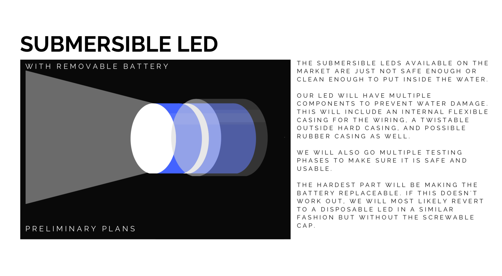

# Components of the Sensor

The primary function of this submersible sensor is to give us real time footage of the particles suspended
within the water and simultaneously provide us with accurate concentration readings so we can have a viewable
and numerical understanding of what happens within the tanks. That being said the mobile application
will utilize image processing to read concentration.

Besides the programming component with the mobile/web application, 
we also want to change some physical aspects regarding the endoscope/borescope.
This will have 2 parts to it. 

The first is a 3D printed casing to bend the endoscope camera 90 degrees. 
The endoscope originally comes straight, so if we lower it down, 
it will have a vertical view downwards of the tank. This will most likely disrupt the particles and 
cause an inaccurate reading of the concentration. Thus we want to shift the camera
so it faces horizontally. We will achieve this through use of a 3D printed casing that will fit around the
scope and hole a bent shape. This casing will also house the LED opposite the scope.

The second component is an LED. The endoscope comes with LEDs of its own however, because this light will
reflect off the particles and change our readings, we need to dim the LEDs on the endoscope down and make an
LED facing the endoscope, so that the silhouette of the particles shows and it'll be easier to read the image.

