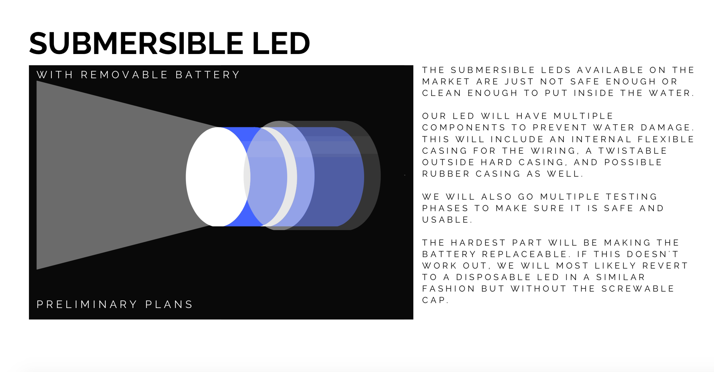

# Submersible Sensor

Throughout the semester, we will update this page with current tasks, projects completed,
and other things we want to have easy access to.

## About Us

Our goal is to create a lowcost but efficient concentration detector by essentially hijacking 
cheap endoscopes/borescopes and merging its function with code and physical additions of our own.
By designing a mobile application that utilizes image processing and basic equations relating 
the image values to concentrations, we can both get a visual of what is going on in each level of depth
and determine using a threshold value where the sludge blanket begins.

The current members of this subteam are 

* Lois Lee (LL556) 
* Srilekha Vangavolu (SV397)
* Hannah Si (HS649)

To learn more about the specifics of our subteam, please look through the tabs below.

* [Logbook](./logs/logs.md)
* [Manuals](./manuals/manuals.md)
* [Drawings](./drawings/drawings.md)
* [Code](./code/code.md)

# The Components of the Submersible Sensor:

Besides the programming component with the mobile/web application, 
we also want to change some physical aspects regarding the endoscope/borescope.
This will have 2 parts to it. The first is a 3D printed casing to bend the endoscope camera 90 degrees. 
The endoscope originally comes straight, so if we lower it down, 
it will have a vertical view downwards of the tank. This will most likely disrupt the particles and 
cause an inaccurate reading of the concentration. Thus we want to shift the camera
so it faces horizontally.

The second component is an LED. The endoscope comes with LEDs of its own however, because this light will
reflect off the particles and change our readings, we need to dim the LEDs on the endoscope down and make an
LED facing the endoscope, so that the silhouette of the particles shows and it'll be easier to read the image.

